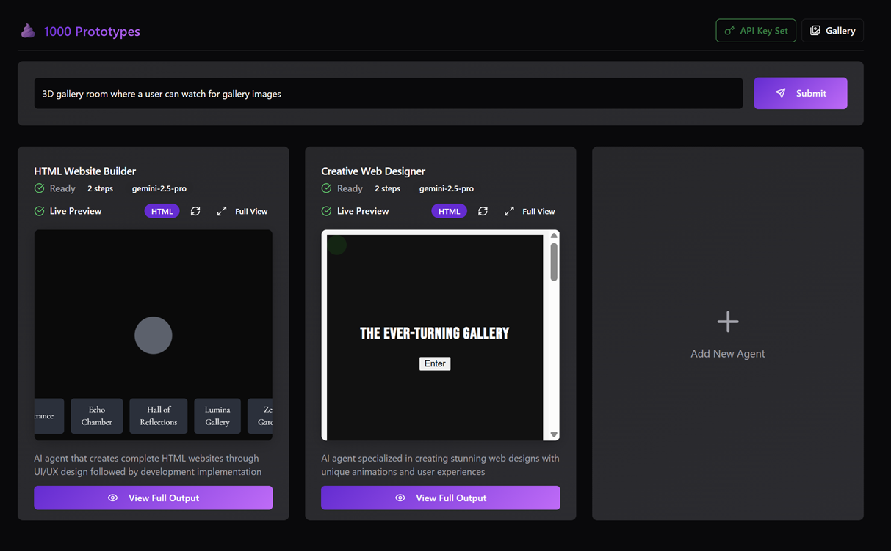

# 1000 Prototypes

**Run multiple AI agents in parallel to prototype websites and apps**

### Try It Online
Participate at [1000prototypes.space](https://1000prototypes.space)

Instead of waiting for one AI assistant to build your idea, this tool lets you deploy multiple specialized agents that work on the same request simultaneously. You get different approaches and can pick the best parts from each.



## Why I Built This

I got tired of the back-and-forth with AI tools, I mostly want to shoot out multiple trys when building webinterface prototypes to choose a cool one. You describe something, get one interpretation, then spend forever trying to guide it toward what you actually wanted.

This approach is different: set up multiple agents with different specialties, give them all the same brief, and see what each one comes up with. One might nail the layout, another might have better functionality, and a third might surprise you with a creative approach you hadn't considered.

## What You Can Do

- **Deploy multiple AI agents** with custom prompt sequences
- **Compare results side by side** and see different interpretations  
- **Share agents** you've created with the community
- **Try different AI models** to see which works best for different tasks
- **Save prototypes** you like to a gallery

The community has built agents for e-commerce sites, portfolios, SaaS landing pages, blogs, interactive experiences, and mobile apps. Check out [1000prototypes.space](https://1000prototypes.space) to see what's possible.

## Getting Started

### Run Locally

```bash
# Clone the repo
git clone https://github.com/DomEscobar/1000prototypes.git
cd creative-ai-architects

# Install dependencies
npm install
cd server && bun install

# Start everything
npm run dev:full
```

### Deploy with Docker

```bash
cd docker
docker-compose up -d
```

Works on Railway, AWS, Google Cloud, or wherever you can run Docker.

## How It Works

Each agent has a sequence of prompts that build on each other. The first prompt might analyze your request and plan the approach, the second might generate the HTML structure, and the third might add styling and interactions.

## Contributing

This is an open source project and contributions are welcome. Whether you want to:

- **Create new agent templates** for the community
- **Improve the UI/UX** of the platform
- **Add new features** to the backend
- **Fix bugs** or improve performance
- **Write documentation** or tutorials

Just open an issue or submit a PR. The codebase is fairly straightforward - React frontend with a Bun/Hono backend.

## Tech Stack

**Frontend**: React + TypeScript, Vite, Tailwind CSS + shadcn/ui  
**Backend**: Bun + Hono with streaming support  
**Storage**: JSON files (simple and effective for this use case)  
**Deployment**: Docker + Nginx  

## Community

- **Issues/Features**: Use GitHub issues for bugs or feature requests
- **Discussions**: GitHub discussions for questions and ideas  

The goal is to build a useful tool for developers who want to prototype faster and explore different AI approaches to the same problem.

## License

MIT - build whatever you want with it.
